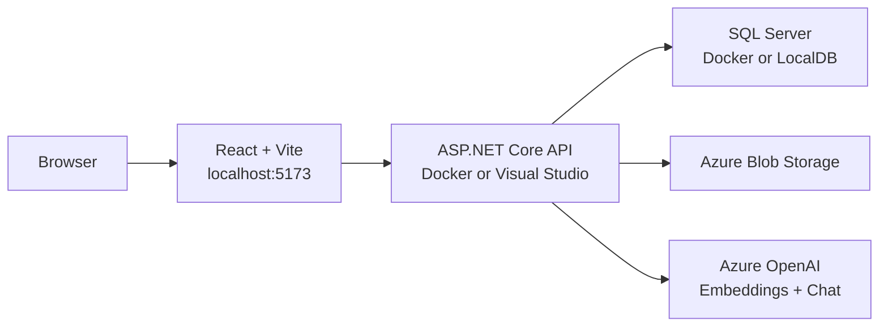
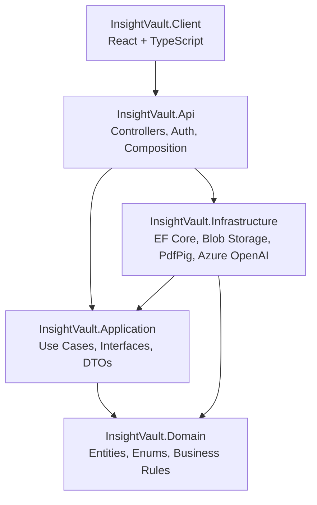
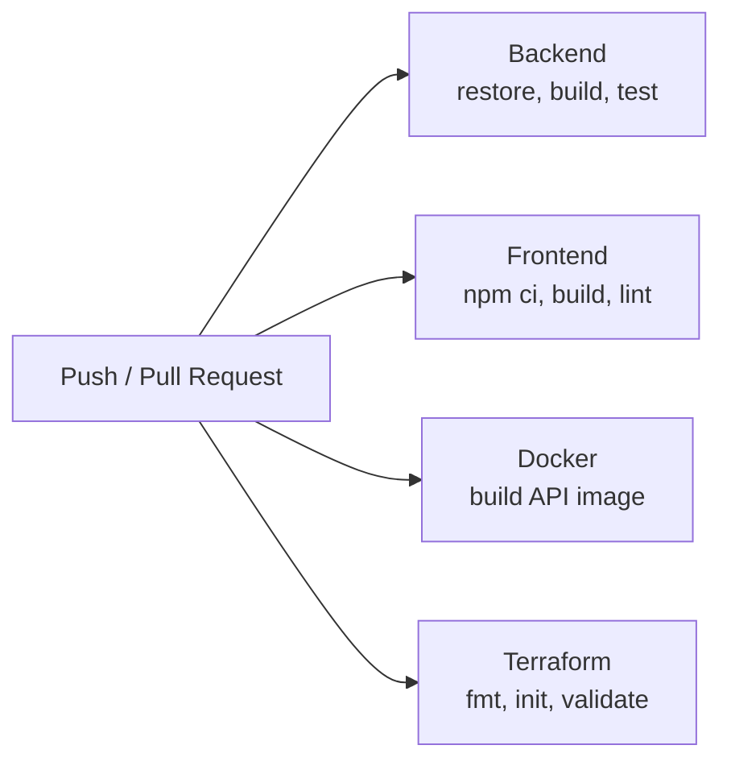
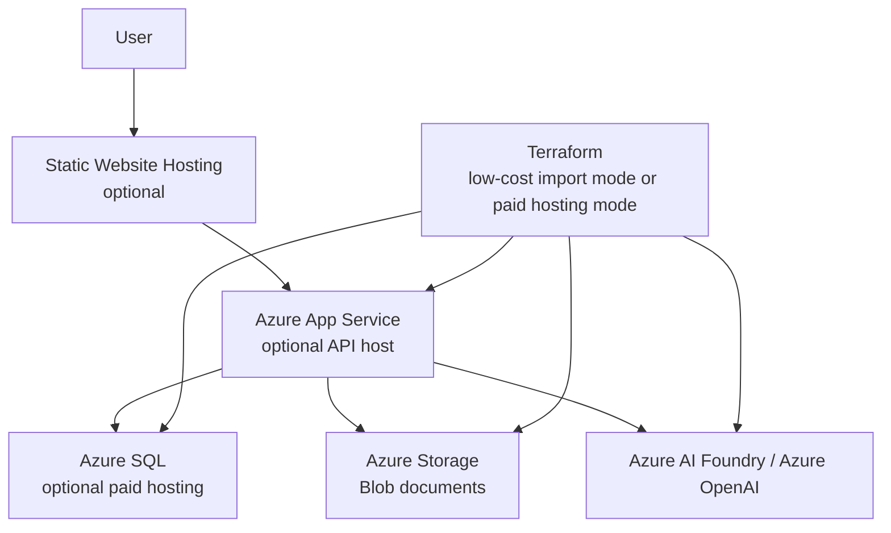

# InsightVault

InsightVault is an AI-powered document intelligence application for uploading PDFs, processing their content, searching semantically, and asking grounded questions over a private document library.

It is built as a portfolio-grade full-stack project using ASP.NET Core, React, SQL Server, Azure Blob Storage, Azure OpenAI, Docker, Terraform, and GitHub Actions.

## Highlights

- PDF upload, listing, processing, sharing, and deletion
- Local user accounts with JWT authentication
- Owner-scoped and viewer-scoped document access
- PDF text extraction, chunking, embedding generation, and vector persistence
- Semantic search with cosine similarity ranking
- RAG chat with grounded answers and source citations
- Clean Architecture project structure
- Docker Compose local environment for API and SQL Server
- Terraform scaffold for low-cost Azure resource management and optional paid hosting
- GitHub Actions CI for backend, frontend, Docker, and Terraform validation
- xUnit tests for Domain and Application behavior

## Screenshots

Screenshots are intentionally left as placeholders until the repository is ready to make public. Add images under `docs/screenshots/` using these filenames.

### Document Library

Placeholder: `docs/screenshots/01-document-library-overview.png`

Show the logged-in app with the upload panel, semantic search panel, RAG chat panel, and document list visible.

### Upload And Document Management

Placeholder: `docs/screenshots/02-uploaded-documents.png`

Show uploaded PDFs with status, chunk count, access level, process, share, and delete actions.

### Document Processing

Placeholder: `docs/screenshots/03-processed-document.png`

Show a processed document with `Processed` status and a chunk count greater than zero.

### Semantic Search

Placeholder: `docs/screenshots/04-semantic-search.png`

Show a semantic search query with ranked results and similarity scores.

### RAG Chat With Source Citations

Placeholder: `docs/screenshots/05-rag-chat.png`

Show a grounded answer with source citations from document chunks.

### CI Quality Gates

Placeholder: `docs/screenshots/06-github-actions-ci.png`

Show GitHub Actions with Backend, Frontend, Docker, and Terraform jobs passing.

## What It Does

### Document Management

- Upload PDF documents from the React client
- Store uploaded files in Azure Blob Storage
- Store document metadata in SQL Server
- List owned and shared documents
- Delete owned documents from the UI and API
- Track document processing status: `Uploaded`, `Processing`, `Processed`, `Failed`

### Processing And Search

- Extract text from uploaded PDFs with PdfPig
- Split extracted text into overlapping chunks
- Generate embeddings through Azure OpenAI
- Persist chunks and embedding vectors in SQL Server
- Search processed document chunks semantically
- Rank search results by cosine similarity

### RAG Chat

- Ask natural-language questions against processed documents
- Retrieve relevant chunks using semantic search
- Generate grounded answers through Azure OpenAI chat completions
- Return source citations for the chunks used in the answer

### Security And Access Control

- Register and log in with local user accounts
- Protect document, search, and chat APIs with JWT bearer authentication
- Scope document access to owners and explicitly shared viewers
- Prevent viewers from processing, sharing, or deleting documents
- Clear expired frontend sessions when protected APIs return `401 Unauthorized`
- Enforce server-side PDF upload validation
- Keep blob names out of public document DTOs

## Architecture

### Local Development Architecture



### Clean Architecture



Dependency rules:

- Domain does not reference Application or Infrastructure.
- Application does not reference Infrastructure.
- Infrastructure implements Application interfaces.
- Controllers stay thin and delegate business workflows to Application services.

### CI Pipeline



The CI pipeline is intentionally simple. It validates the application, frontend, Dockerfile, and Terraform configuration. It does not deploy or create paid Azure resources.

### Optional Azure Deployment Path



Paid Azure hosting is optional and disabled by default in Terraform.

## Project Structure

```text
src/
  InsightVault.Api             ASP.NET Core API, auth, controllers, DI
  InsightVault.Application     Use cases, commands, DTOs, interfaces
  InsightVault.Domain          Entities, enums, domain rules
  InsightVault.Infrastructure  EF Core, Blob Storage, PDF extraction, Azure OpenAI
  InsightVault.Client          React + TypeScript frontend

tests/
  InsightVault.Tests           xUnit tests for domain and application behavior

infra/
  terraform                    Azure infrastructure scaffold

.github/
  workflows                    CI pipeline
```

## API Overview

Protected document, search, and chat endpoints require:

```http
Authorization: Bearer {token}
```

### Authentication

```http
POST /api/auth/register
POST /api/auth/login
```

Request:

```json
{
  "email": "user@example.com",
  "password": "Password123"
}
```

Returns:

- `userId`
- `email`
- `token`

### Documents

```http
GET    /api/documents
POST   /api/documents
POST   /api/documents/{id}/process
POST   /api/documents/{id}/share
DELETE /api/documents/{id}
```

Document list responses include:

- `id`
- `originalFileName`
- `contentType`
- `sizeInBytes`
- `uploadedAtUtc`
- `status`
- `chunkCount`
- `isOwner`
- `accessLevel`

Upload validation is enforced server-side:

- only `.pdf` files
- only `application/pdf` content type
- non-empty files
- maximum size of 25 MB

### Semantic Search

```http
GET /api/search?query={query}&maxResults=10
```

Returns ranked chunks:

- `documentId`
- `documentName`
- `chunkId`
- `chunkIndex`
- `text`
- `score`

### RAG Chat

```http
POST /api/chat
Content-Type: application/json
```

Request:

```json
{
  "question": "What are the most important points in these documents?",
  "maxSources": 5
}
```

Returns:

- `answer`
- `sources`

## Configuration

`src/InsightVault.Api/appsettings.json` contains safe default development settings. Secrets are intentionally blank.

```json
{
  "ConnectionStrings": {
    "DefaultConnection": "Server=(localdb)\\mssqllocaldb;Database=InsightVault;Trusted_Connection=True;MultipleActiveResultSets=true"
  },
  "AzureBlobStorage": {
    "ConnectionString": "",
    "ContainerName": "documents"
  },
  "AzureOpenAI": {
    "Endpoint": "",
    "ApiKey": "",
    "EmbeddingDeploymentName": "",
    "ChatDeploymentName": "",
    "ApiVersion": "2024-10-21"
  },
  "Jwt": {
    "Issuer": "InsightVault",
    "Audience": "InsightVault.Client",
    "SigningKey": "",
    "ExpiresMinutes": 60
  },
  "Cors": {
    "AllowedOrigins": [
      "http://localhost:5173",
      "https://localhost:5173",
      "http://localhost:56772",
      "https://localhost:56772"
    ]
  }
}
```

Use user secrets or environment variables for local secrets:

```bash
dotnet user-secrets set "AzureBlobStorage:ConnectionString" "<blob-storage-connection-string>" --project src/InsightVault.Api
dotnet user-secrets set "AzureOpenAI:Endpoint" "https://<resource-name>.openai.azure.com" --project src/InsightVault.Api
dotnet user-secrets set "AzureOpenAI:ApiKey" "<azure-openai-api-key>" --project src/InsightVault.Api
dotnet user-secrets set "AzureOpenAI:EmbeddingDeploymentName" "<embedding-deployment-name>" --project src/InsightVault.Api
dotnet user-secrets set "AzureOpenAI:ChatDeploymentName" "<chat-deployment-name>" --project src/InsightVault.Api
dotnet user-secrets set "Jwt:SigningKey" "<at-least-32-character-signing-key>" --project src/InsightVault.Api
```

For deployed environments, configure CORS with `Cors:AllowedOrigins`. Terraform maps this through `Cors__AllowedOrigins` when optional paid hosting is enabled.

## Local Setup

### Option 1: Docker API And SQL Server

Docker Compose runs the API and SQL Server locally without creating paid Azure hosting resources.

```bash
docker compose up --build
```

The API is available at:

```text
http://localhost:5089
```

SQL Server is available from the host at:

```text
localhost,14333
```

Run EF migrations against the Docker SQL Server database:

```bash
dotnet ef database update --project src/InsightVault.Infrastructure --startup-project src/InsightVault.Api --connection "Server=localhost,14333;Database=InsightVault;User Id=sa;Password=InsightVault-Local-Only-Password-123!;TrustServerCertificate=True;MultipleActiveResultSets=true"
```

Optional local secrets can be supplied through environment variables or by copying `docker-compose.override.example.yml` to `docker-compose.override.yml` and filling in local values. Do not commit `docker-compose.override.yml`.

Start the frontend against the Docker API:

```bash
cd src/InsightVault.Client
VITE_API_BASE_URL=http://localhost:5089 npm run dev
```

On PowerShell:

```powershell
cd src/InsightVault.Client
$env:VITE_API_BASE_URL="http://localhost:5089"
npm run dev
```

Stop the containers:

```bash
docker compose down
```

Reset the Docker database:

```bash
docker compose down --volumes
```

### Option 2: Visual Studio / LocalDB

```bash
dotnet restore
dotnet ef database update --project src/InsightVault.Infrastructure --startup-project src/InsightVault.Api
dotnet run --project src/InsightVault.Api
```

Start the frontend:

```bash
cd src/InsightVault.Client
npm install
npm run dev
```

The frontend defaults to:

```text
https://localhost:7227
```

Override it with:

```bash
VITE_API_BASE_URL=https://localhost:7227 npm run dev
```

## Database

Current EF Core migrations:

- `InitialCreate`: creates `Documents`
- `AddDocumentProcessing`: creates `DocumentChunks` and `Embeddings`
- `AddIdentityAndDocumentOwnership`: creates ASP.NET Core Identity tables and adds `Documents.OwnerUserId`
- `AddDocumentPermissions`: creates `DocumentPermissions`

## Cloud Infrastructure

Terraform lives in `infra/terraform`.

The current scaffold defaults to low-cost mode and manages/imports:

- Azure resource group
- Azure Storage for uploaded documents
- Azure AI Foundry / AI Services resource

Paid hosting resources are available only when `enable_paid_hosting = true`:

- Azure App Service Plan
- Azure Linux Web App for the API
- Azure SQL Server and database
- Azure Storage static website hosting for the React frontend
- Log Analytics workspace
- Application Insights

The scaffold includes comments for future production hardening such as Key Vault, managed identities, private networking, Azure AI Search, Foundry agents, multi-environment modules, and Kubernetes.

Start with:

```bash
cd infra/terraform
cp dev.tfvars.example dev.tfvars
terraform init
terraform plan -var-file="dev.tfvars"
```

Do not commit `dev.tfvars`, `imports.tf`, or Terraform state files.

## Engineering Practices

### CI Quality Gates

GitHub Actions validates:

- Backend restore, build, and tests
- Frontend install, build, and lint
- Docker API image build
- Terraform formatting and validation

### Testing

The test suite focuses on Domain and Application behavior:

- document validation
- document upload/list/share/delete workflows
- document chunking
- document processing
- semantic search ranking
- RAG chat orchestration
- failed reprocessing keeps existing chunks

### Security And Reliability Hardening

Implemented:

- JWT-protected document, search, and chat APIs
- owner/viewer document access rules
- CORS origins loaded from configuration
- server-side PDF upload validation
- expired-session handling in the frontend
- blob names removed from public document DTOs
- failed document reprocessing preserves previous chunks
- generated frontend `dist` output is not committed

## AI Engineering Notes

InsightVault uses a direct RAG workflow:

1. Extract text from uploaded PDFs.
2. Split text into chunks.
3. Generate embeddings for each chunk.
4. Store vectors in SQL Server.
5. Embed the user query.
6. Rank chunks by cosine similarity.
7. Send the top chunks to Azure OpenAI chat completions.
8. Return a grounded answer with source citations.

Agents are intentionally not implemented yet. The current workflow is deterministic and does not need autonomous tool use or multi-step planning. Agentic workflows would be a future extension if the app needed actions such as document comparison, scheduled review, user-driven tool execution, or multi-document research tasks.

## Future Improvements

- Add real screenshots and GitHub Actions badge before making the repo public
- Add `docs/deployment.md` for local, Docker, Terraform import, and optional paid hosting workflows
- Add a short secret rotation and cost-safety checklist
- Improve delete consistency between database rows and blob deletion
- Add status badges after CI is stable
- Add optional Azure Key Vault and managed identity support for a real cloud deployment
- Add Azure AI Search only if SQL vector storage becomes insufficient
- Add agents only when autonomous workflows provide clear product value

## Purpose

InsightVault is designed to demonstrate practical full-stack engineering:

- Clean Architecture with ASP.NET Core
- real document ingestion and processing workflows
- SQL Server and Azure Blob Storage integration
- Azure OpenAI embeddings and chat completions
- RAG with source citations
- ASP.NET Core Identity and JWT authentication
- secure owner/viewer document access
- React + TypeScript frontend development
- Docker-based local development
- Terraform-based Azure infrastructure planning
- CI quality gates with GitHub Actions
