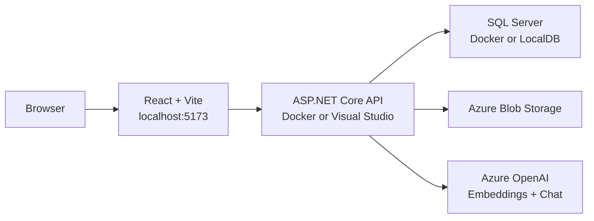
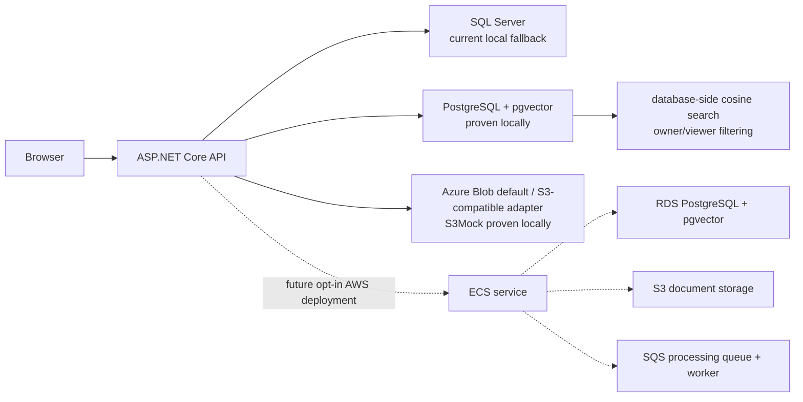
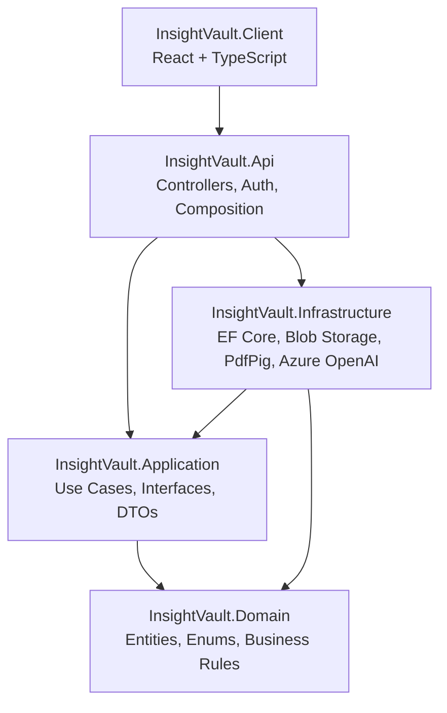
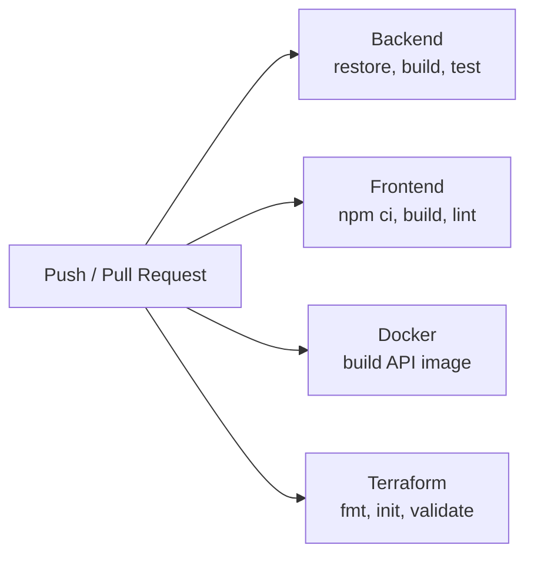
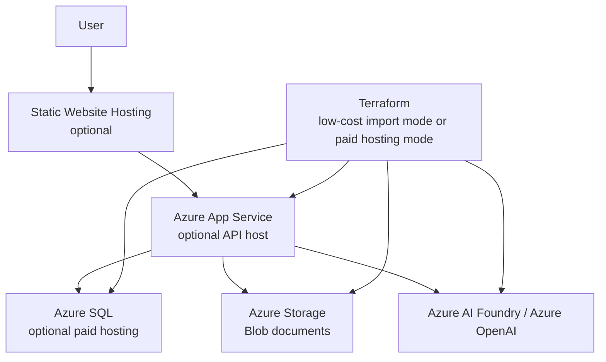

# InsightVault

[](https://github.com/SB4647/InsightVault/actions/workflows/ci.yml)

InsightVault is an AI-powered document intelligence application for uploading PDFs, processing their content, searching semantically, and asking grounded questions over a private document library.

It is built as a portfolio-grade full-stack project using ASP.NET Core, React, SQL Server, Azure Blob Storage, an S3-compatible storage adapter, Azure OpenAI, Docker, Terraform, and GitHub Actions.

## Highlights

- PDF upload, listing, processing, sharing, and deletion
- Local user accounts with JWT authentication
- Owner-scoped and viewer-scoped document access
- PDF text extraction, chunking, embedding generation, and vector persistence
- Hybrid full-text plus vector retrieval with bounded, configurable quality controls
- RAG chat with grounded answers, page-aware source citations, and stored provenance
- Clean Architecture project structure
- Azure Blob Storage by default, with an S3-compatible document-storage adapter
- Docker Compose local environment for API, SQL Server, PostgreSQL, and opt-in S3Mock
- Terraform scaffold for low-cost Azure resource management and optional paid hosting
- GitHub Actions CI for backend, frontend, Docker, and Terraform validation
- xUnit tests for Domain and Application behavior

## Screenshots

The screenshots below show the main local workflow: authentication, processed document management, semantic search, and RAG chat with source citations.

### Login


Local account login using JWT authentication.

### Main Page


Signed-in document workspace with upload, search, chat, and document management areas.

### Uploaded Documents


Uploaded PDF with processing status, chunk count, sharing, refresh, and delete actions.

### Semantic Search


Semantic search over processed document chunks with similarity scores.

### RAG Chat


Grounded answer generated from retrieved document chunks, with cited sources shown below the response.

## What It Does

### Document Management

- Upload PDF documents from the React client
- Store uploaded files in Azure Blob Storage by default, or an S3-compatible implementation when explicitly selected
- Store document metadata in SQL Server
- List owned and shared documents
- Delete owned documents from the UI and API
- Track document processing status: `Uploaded`, `Processing`, `Processed`, `Failed`

### Processing And Search

- Extract text from uploaded PDFs with PdfPig
- Split extracted text into overlapping chunks
- Generate embeddings through Azure OpenAI
- Persist chunks and embedding vectors in SQL Server
- Search processed document chunks with full-text and vector candidates
- Fuse candidates with reciprocal-rank fusion, a server-owned Top-K, and a similarity threshold

### RAG Chat

- Ask natural-language questions against processed documents
- Retrieve relevant chunks using semantic search
- Generate grounded answers through Azure OpenAI chat completions
- Return source citations with document version, page, section, and final rank
- Persist successful answer-to-chunk provenance for audit; no answer-history screen is exposed yet

### Security And Access Control

- Register and log in with local user accounts
- Protect document, search, and chat APIs with JWT bearer authentication
- Scope document access to owners and explicitly shared viewers
- Prevent viewers from processing, sharing, or deleting documents
- Clear expired frontend sessions when protected APIs return `401 Unauthorized`
- Enforce server-side PDF upload validation
- Keep blob names out of public document DTOs
- Limit authentication, upload, chat, and search requests before they consume unnecessary resources
- Enforce owner-level document-count and storage quotas in a serializable database transaction
- Reject obvious question prompt-injection attempts before retrieval and treat PDF text as untrusted reference data
- Log only safe request diagnostics: no bodies, tokens, keys, document text, connection strings, or SSO credentials

## Architecture

### Local Development Architecture


```mermaid
flowchart LR
    Browser["Browser"]
    React["React + Vite\nlocalhost:5173"]
    Api["ASP.NET Core API\nDocker or Visual Studio"]
    Sql["SQL Server\nDocker or LocalDB"]
    Blob["Azure Blob Storage"]
    OpenAI["Azure OpenAI\nEmbeddings + Chat"]

    Browser --> React
    React --> Api
    Api --> Sql
    Api --> Blob
    Api --> OpenAI
```

### AWS-Ready Retrieval Path


```mermaid
flowchart LR
    Browser["Browser"] --> Api["ASP.NET Core API"]

    Api --> SqlServer["SQL Server\ncurrent local fallback"]
    Api --> Postgres["PostgreSQL + pgvector\nproven locally"]
    Api --> ObjectStorage["Azure Blob default / S3-compatible adapter\nS3Mock proven locally"]
    Postgres --> VectorSearch["database-side cosine search\nowner/viewer filtering"]

    Api -. "future opt-in AWS deployment" .-> Ecs["ECS service"]
    Ecs -.-> Rds["RDS PostgreSQL + pgvector"]
    Ecs -.-> S3["S3 document storage"]
    Ecs -.-> Sqs["SQS processing queue + worker"]
```

Solid connections show the current local implementation. Dashed connections show the planned AWS deployment design only: none of those AWS resources have been created or charged to this project.

### Clean Architecture


```mermaid
flowchart TD
    Api["InsightVault.Api\nControllers, Auth, Composition"]
    Application["InsightVault.Application\nUse Cases, Interfaces, DTOs"]
    Domain["InsightVault.Domain\nEntities, Enums, Business Rules"]
    Infrastructure["InsightVault.Infrastructure\nEF Core, Blob Storage, PdfPig, Azure OpenAI"]
    Client["InsightVault.Client\nReact + TypeScript"]

    Client --> Api
    Api --> Application
    Application --> Domain
    Infrastructure --> Application
    Infrastructure --> Domain
    Api --> Infrastructure
```

Dependency rules:

- Domain does not reference Application or Infrastructure.
- Application does not reference Infrastructure.
- Infrastructure implements Application interfaces.
- Controllers stay thin and delegate business workflows to Application services.

### CI Pipeline


```mermaid
flowchart LR
    Push["Push / Pull Request"]
    Backend["Backend\nrestore, build, test"]
    Frontend["Frontend\nnpm ci, build, lint"]
    Docker["Docker\nbuild API image"]
    Terraform["Terraform\nfmt, init, validate"]

    Push --> Backend
    Push --> Frontend
    Push --> Docker
    Push --> Terraform
```

The CI pipeline is intentionally simple. It validates the application, frontend, Dockerfile, and Terraform configuration. It does not deploy or create paid Azure resources.

### Optional Azure Deployment Path


```mermaid
flowchart TD
    User["User"]
    StaticWeb["Static Website Hosting\noptional"]
    AppService["Azure App Service\noptional API host"]
    AzureSql["Azure SQL\noptional paid hosting"]
    Storage["Azure Storage\nBlob documents"]
    Foundry["Azure AI Foundry / Azure OpenAI"]
    Terraform["Terraform\nlow-cost import mode or paid hosting mode"]

    User --> StaticWeb
    StaticWeb --> AppService
    AppService --> AzureSql
    AppService --> Storage
    AppService --> Foundry
    Terraform --> AppService
    Terraform --> AzureSql
    Terraform --> Storage
    Terraform --> Foundry
```

Paid Azure hosting is optional and disabled by default in Terraform.

## Project Structure

```text
src/
  InsightVault.Api             ASP.NET Core API, auth, controllers, DI
  InsightVault.Application     Use cases, commands, DTOs, interfaces
  InsightVault.Domain          Entities, enums, domain rules
  InsightVault.Infrastructure  EF Core, Blob Storage, PDF extraction, Azure OpenAI
  InsightVault.Client          React + TypeScript frontend

tests/
  InsightVault.Tests           xUnit tests for domain and application behavior

infra/
  terraform                    Azure infrastructure scaffold

.github/
  workflows                    CI pipeline
```

## API Overview

Protected document, search, and chat endpoints require:

```http
Authorization: Bearer {token}
```

### Authentication

```http
POST /api/auth/register
POST /api/auth/login
```

Request:

```json
{
  "email": "user@example.com",
  "password": "Password123"
}
```

Returns:

- `userId`
- `email`
- `token`

### Documents

```http
GET    /api/documents
POST   /api/documents
POST   /api/documents/{id}/process
POST   /api/documents/{id}/share
DELETE /api/documents/{id}
```

Document list responses include:

- `id`
- `originalFileName`
- `contentType`
- `sizeInBytes`
- `uploadedAtUtc`
- `status`
- `chunkCount`
- `isOwner`
- `accessLevel`

Upload validation is enforced server-side:

- only `.pdf` files
- only `application/pdf` content type
- non-empty files
- maximum size of 25 MB

### Semantic Search

```http
GET /api/search?query={query}
```

Returns ranked chunks:

- `documentId`
- `documentName`
- `chunkId`
- `chunkIndex`
- `documentVersion`
- `sourcePageNumber`
- `sectionTitle`
- `rank`
- `text`
- `score`

### RAG Chat

```http
POST /api/chat
Content-Type: application/json
```

Request:

```json
{
  "question": "What are the most important points in these documents?"
}
```

Returns:

- `answer`
- `sources`

## Configuration

`src/InsightVault.Api/appsettings.json` contains safe default development settings. Secrets are intentionally blank.

```json
{
  "ConnectionStrings": {
    "DefaultConnection": "Server=(localdb)\\mssqllocaldb;Database=InsightVault;Trusted_Connection=True;MultipleActiveResultSets=true"
  },
  "AzureBlobStorage": {
    "ConnectionString": "",
    "ContainerName": "documents"
  },
  "Storage": {
    "Provider": "Azure"
  },
  "UploadQuota": {
    "MaxDocumentsPerOwner": 100,
    "MaxStoredBytesPerOwner": 500000000
  },
  "RateLimiting": {
    "AuthenticationPermitLimit": 5,
    "UploadPermitLimit": 10,
    "InteractivePermitLimit": 30
  },
  "Retrieval": {
    "TopK": 5,
    "CandidateMultiplier": 4,
    "MinimumSimilarity": 0.60,
    "FullTextOnlyScore": 0.60
  },
  "AzureOpenAI": {
    "Endpoint": "",
    "ApiKey": "",
    "EmbeddingDeploymentName": "",
    "ChatDeploymentName": "",
    "ApiVersion": "2024-10-21"
  },
  "Jwt": {
    "Issuer": "InsightVault",
    "Audience": "InsightVault.Client",
    "SigningKey": "",
    "ExpiresMinutes": 60
  },
  "Cors": {
    "AllowedOrigins": [
      "http://localhost:5173",
      "https://localhost:5173",
      "http://localhost:56772",
      "https://localhost:56772"
    ]
  }
}
```

`Storage:Provider` is `Azure` by default. Set it to `S3` only when using the S3 adapter. For a deployed S3 bucket, configure `S3Storage:BucketName` and `S3Storage:Region` only: leave `ServiceUrl`, `AccessKey`, and `SecretKey` empty so the AWS SDK uses the deployed workload role. Never copy developer SSO credentials or static AWS access keys into application configuration.

Use user secrets or environment variables for local secrets:

```bash
dotnet user-secrets set "AzureBlobStorage:ConnectionString" "<blob-storage-connection-string>" --project src/InsightVault.Api
dotnet user-secrets set "AzureOpenAI:Endpoint" "https://<resource-name>.openai.azure.com" --project src/InsightVault.Api
dotnet user-secrets set "AzureOpenAI:ApiKey" "<azure-openai-api-key>" --project src/InsightVault.Api
dotnet user-secrets set "AzureOpenAI:EmbeddingDeploymentName" "<embedding-deployment-name>" --project src/InsightVault.Api
dotnet user-secrets set "AzureOpenAI:ChatDeploymentName" "<chat-deployment-name>" --project src/InsightVault.Api
dotnet user-secrets set "Jwt:SigningKey" "<at-least-32-character-signing-key>" --project src/InsightVault.Api
```

For deployed environments, configure CORS with `Cors:AllowedOrigins`. Terraform maps this through `Cors__AllowedOrigins` when optional paid hosting is enabled.

## Local Setup

### Option 1: Docker API And SQL Server

Docker Compose runs the API and SQL Server locally without creating paid Azure hosting resources.

```bash
docker compose up --build
```

The API is available at:

```text
http://localhost:5089
```

The API health check is available at:

```text
http://localhost:5089/health
```

SQL Server is available from the host at:

```text
localhost,14333
```

Run EF migrations against the Docker SQL Server database:

```bash
dotnet ef database update --project src/InsightVault.Infrastructure --startup-project src/InsightVault.Api --connection "Server=localhost,14333;Database=InsightVault;User Id=sa;Password=InsightVault-Local-Only-Password-123!;TrustServerCertificate=True;MultipleActiveResultSets=true"
```

Optional local secrets can be supplied through environment variables or by copying `docker-compose.override.example.yml` to `docker-compose.override.yml` and filling in local values. Do not commit `docker-compose.override.yml`.

Start the frontend against the Docker API:

```bash
cd src/InsightVault.Client
VITE_API_BASE_URL=http://localhost:5089 npm run dev
```

On PowerShell:

```powershell
cd src/InsightVault.Client
$env:VITE_API_BASE_URL="http://localhost:5089"
npm run dev
```

To run the API, SQL Server, and React client through Docker Compose:

```bash
docker compose --profile frontend up --build
```

The Dockerized client is available at:

```text
http://localhost:56772
```

This full Docker mode is optional. Running the client locally with Vite is still faster for day-to-day frontend work.

Stop the containers:

```bash
docker compose down
```

Reset the Docker database:

```bash
docker compose down --volumes
```

### Option 2: Visual Studio / LocalDB

```bash
dotnet restore
dotnet ef database update --project src/InsightVault.Infrastructure --startup-project src/InsightVault.Api
dotnet run --project src/InsightVault.Api
```

Start the frontend:

```bash
cd src/InsightVault.Client
npm install
npm run dev
```

The frontend defaults to:

```text
https://localhost:7227
```

Override it with:

```bash
VITE_API_BASE_URL=https://localhost:7227 npm run dev
```

### Local PostgreSQL And pgvector Foundation

The PostgreSQL service is opt-in while InsightVault retains its SQL Server development path. The API can select the PostgreSQL persistence provider with `Database:Provider=Postgres`; this enables pgvector-backed retrieval without removing the existing SQL Server path. Running it locally does not create an AWS resource.

```powershell
docker compose --profile postgres up -d postgres
docker compose --profile postgres ps
```

PostgreSQL is available from the host at `localhost:5433`. The checked-in [PostgreSQL example configuration](src/InsightVault.Api/appsettings.Postgres.example.json) sets `Database:Provider=Postgres` and uses the Docker network host name `postgres` for a containerised API. Use `localhost` instead when the API runs directly from Visual Studio or `dotnet run`.

### Step 3 Local Proof: Completed

The following evidence was run against the local Docker PostgreSQL service. It proves that InsightVault can create its PostgreSQL schema, enable pgvector, and execute protected vector retrieval without needing an AWS account or creating AWS costs.

```powershell
# 1. Start the opt-in PostgreSQL + pgvector service.
docker compose --profile postgres up -d postgres

# 2. Apply the PostgreSQL-specific EF Core migration.
dotnet ef database update --project src/InsightVault.Infrastructure --startup-project src/InsightVault.Api --context PostgresApplicationDbContext

# 3. Run the PostgreSQL + pgvector integration tests.
dotnet test InsightVault.slnx --no-restore --filter "FullyQualifiedName~PostgresVectorSearchTests" --logger "console;verbosity=minimal"
```

Verified results:

- Docker reported the `postgres` service as healthy and exposed it at `localhost:5433`.
- EF Core applied `20261002061254_InitialPostgres` to the local PostgreSQL database. The first migration run may show an initial missing `__EFMigrationsHistory` query before EF Core creates that table; this is expected for an empty database.
- The pgvector integration test run passed `2/2`: it checked nearest authorised chunk ranking and denied an unrelated user access to the vectors.
- The full test suite also passed `49/49` tests.

The `postgres-data` Docker volume is local to this computer. Stop the service when finished with `docker compose --profile postgres down`; use `--volumes` only when you intentionally want to erase that local database.

The data volume is disposable. Remove it only when you intend to erase local PostgreSQL data:

```powershell
docker compose --profile postgres down --volumes
```

### Local S3-Compatible Document Storage

The S3 adapter is opt-in; Azure Blob remains the default. The local S3Mock emulator uses dummy local-only credentials and does not contact AWS or use your `insightvault-dev` SSO profile.

Start the emulator for a manual API run:

```powershell
docker compose --profile s3 up -d s3mock
```

To run the Docker API against the emulator, copy `docker-compose.override.example.yml` to the ignored `docker-compose.override.yml`, then start the full local stack with the `s3` profile:

```powershell
Copy-Item docker-compose.override.example.yml docker-compose.override.yml
docker compose --profile s3 up -d
```

The copied override selects `Storage:Provider=S3`, points the API to `http://s3mock:9090`, and uses a pre-created local bucket. It starts the API, SQL Server, and S3Mock; it still does not contact AWS.

The focused integration test starts and removes its own temporary S3Mock container, so it needs Docker Desktop but no AWS account or configuration:

```powershell
dotnet test tests/InsightVault.Tests/InsightVault.Tests.csproj --no-restore --filter "FullyQualifiedName~S3BlobStorageServiceTests"
```

For a direct local API run instead of Docker Compose, use the checked-in [S3 local example](src/InsightVault.Api/appsettings.S3.example.json) as a reference and set equivalent environment variables for the process. Do not commit a copied `appsettings.S3.json`; it is ignored because it may contain local credentials.

## Database

Current EF Core migrations:

- `InitialCreate`: creates `Documents`
- `AddDocumentProcessing`: creates `DocumentChunks` and `Embeddings`
- `AddIdentityAndDocumentOwnership`: creates ASP.NET Core Identity tables and adds `Documents.OwnerUserId`
- `AddDocumentPermissions`: creates `DocumentPermissions`

## Cloud Infrastructure

Terraform lives in `infra/terraform`.

The current scaffold defaults to low-cost mode and manages/imports:

- Azure resource group
- Azure Storage for uploaded documents
- Azure AI Foundry / AI Services resource

Paid hosting resources are available only when `enable_paid_hosting = true`:

- Azure App Service Plan
- Azure Linux Web App for the API
- Azure SQL Server and database
- Azure Storage static website hosting for the React frontend
- Log Analytics workspace
- Application Insights

The scaffold includes comments for future production hardening such as Key Vault, managed identities, private networking, Azure AI Search, Foundry agents, multi-environment modules, and Kubernetes.

Start with:

```bash
cd infra/terraform
cp dev.tfvars.example dev.tfvars
terraform init
terraform plan -var-file="dev.tfvars"
```

Do not commit `dev.tfvars`, `imports.tf`, or Terraform state files.

See [docs/deployment.md](docs/deployment.md) for local, Docker, Terraform import, and optional paid hosting notes.

### AWS S3 Design: Declared, Not Deployed

The separate [AWS Terraform module](infra/aws/README.md) declares a private document bucket, S3-managed encryption, public-access blocking, TLS-only access, and lifecycle cleanup. `terraform init -backend=false` and `terraform validate` are safe local checks. Do not run `plan` or `apply` for this module until you deliberately choose to deploy and accept the associated AWS charges.

### Step 7: Security and Cost Controls

InsightVault applies local API rate limits (authentication: 5 requests/minute per IP; uploads: 10/hour per user; chat and search: 30/minute per user), plus an owner-only quota of 100 documents and 500 MB by default. Adjust these non-secret values in `appsettings.json` only when you understand the impact on genuine users.

Chat questions are checked for obvious instruction-override attempts before retrieval. Document excerpts are sent to the model as explicitly marked untrusted reference data, so instructions found inside a PDF cannot override the system rules. Request and worker logs contain trace IDs and operational metadata, not questions, document text, authentication headers, API keys, connection strings, or AWS credentials.

The authentication limiter intentionally keys on the direct TCP client IP address. InsightVault does **not** trust `X-Forwarded-For` by default because a public client can forge that header. Before placing the API behind an ALB or another reverse proxy, configure ASP.NET Core forwarded headers with that proxy's trusted private network; otherwise every request could be attributed to the proxy rather than the real client.

The AWS Terraform module declares future least-privilege API and worker task roles behind `enable_workload_iam_roles = false`. It can reference exact existing Secrets Manager ARNs, but never creates a secret. IAM itself is free; S3 storage/requests, SQS requests, and stored Secrets Manager secrets can cost money only after an explicitly approved apply. See [the AWS Terraform guide](infra/aws/README.md) for permission and cost details.

## Engineering Practices

### CI Quality Gates

GitHub Actions validates:

- Backend restore, build, and tests
- Frontend install, build, and lint
- Docker API image build
- Terraform formatting and validation

### Testing

The test suite focuses on Domain and Application behavior:

- document validation
- document upload/list/share/delete workflows
- document chunking
- document processing
- semantic search ranking
- RAG chat orchestration
- hybrid retrieval ranking, permission filtering, and evaluation thresholds
- answer-to-chunk provenance persistence
- failed reprocessing keeps existing chunks

Run the deterministic retrieval-quality evaluation locally; it uses checked-in JSON and no cloud services:

```powershell
dotnet test tests/InsightVault.Tests/InsightVault.Tests.csproj --filter "FullyQualifiedName~RetrievalEvaluationTests"
```

The current gate requires average recall@5 of at least `0.80` and precision@5 of at least `0.60`.

### Security And Reliability Hardening

Implemented:

- JWT-protected document, search, and chat APIs
- owner/viewer document access rules
- CORS origins loaded from configuration
- server-side PDF upload validation
- basic API health endpoint
- expired-session handling in the frontend
- blob names removed from public document DTOs
- failed document reprocessing preserves previous chunks
- generated frontend `dist` output is not committed

## AI Engineering Notes

InsightVault uses a direct RAG workflow:

1. Extract text from uploaded PDFs.
2. Split text into chunks.
3. Generate embeddings for each chunk.
4. Store vectors in SQL Server.
5. Embed the user query.
6. Rank chunks by cosine similarity.
7. Send the top chunks to Azure OpenAI chat completions.
8. Return a grounded answer with source citations.

Agents are intentionally not implemented yet. The current workflow is deterministic and does not need autonomous tool use or multi-step planning. Agentic workflows would be a future extension if the app needed actions such as document comparison, scheduled review, user-driven tool execution, or multi-document research tasks.

## Future Improvements

- Add a short secret rotation and cost-safety checklist
- Improve delete consistency between database rows and blob deletion
- Add optional Azure Key Vault and managed identity support for a real cloud deployment
- Add Azure AI Search only if SQL vector storage becomes insufficient
- Add agents only when autonomous workflows provide clear product value

## Purpose

InsightVault is designed to demonstrate practical full-stack engineering:

- Clean Architecture with ASP.NET Core
- real document ingestion and processing workflows
- SQL Server and Azure Blob Storage integration
- Azure OpenAI embeddings and chat completions
- RAG with source citations
- ASP.NET Core Identity and JWT authentication
- secure owner/viewer document access
- React + TypeScript frontend development
- Docker-based local development
- Terraform-based Azure infrastructure planning
- CI quality gates with GitHub Actions
