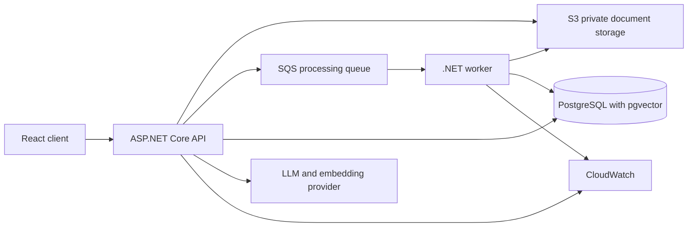

# InsightVault Production AWS Design

## Purpose

This design evolves InsightVault from a local, Azure-oriented RAG prototype into an AWS-ready RAG application without requiring a continuously running paid cloud environment. It preserves the existing Clean Architecture boundaries and keeps the current Azure OpenAI integrations available while introducing an AWS deployment path that can be validated locally.

The project will demonstrate real AWS knowledge through AWS-compatible application integrations, Terraform, least-privilege workload roles, local integration tests, and a separately authorised, short-lived AWS smoke test. It will not claim that an always-on production ECS, load-balancer, NAT, or database deployment is free.

## Constraints

- Domain must not reference Application or Infrastructure.
- Application must not reference Infrastructure.
- Controllers remain thin and delegate workflows to Application services.
- Local development and the complete automated test suite must work without an AWS account, static credentials, or paid model calls.
- AWS credentials must come from the standard AWS credential chain: the developer's named IAM Identity Center profile locally and workload roles when deployed.
- Terraform must validate without `apply`; AWS provisioning and live smoke tests require explicit authorisation.
- The existing Azure Terraform scaffold remains intact. AWS infrastructure lives separately under `infra/aws`.

## Target Architecture

The eventual AWS runtime will place the API and worker on ECS/Fargate behind an Application Load Balancer, with RDS PostgreSQL in private subnets. That architecture is represented and tested as infrastructure-as-code, but it is not deployed by default because those services can incur ongoing charges.

## Environment Model

### Local default

Docker Compose runs PostgreSQL with pgvector. Local integration tests run against disposable containers and must not call AWS or Azure OpenAI. Test doubles remain responsible for embedding and chat responses.

### AWS proof environment

An opt-in smoke test uses the `insightvault-dev` IAM Identity Center profile. It can create only uniquely named, tagged, short-lived proof resources and must delete them after verification. It is disabled in normal tests and CI.

### Future production environment

Terraform supplies separate development, staging, and production settings. Production workloads receive AWS task roles; developers do not supply their personal SSO profile to deployed workloads.

## Implementation Milestones

### 1. PostgreSQL and pgvector foundation

- Add PostgreSQL + pgvector to the local Docker environment.
- Add provider-specific configuration while preserving the existing SQL Server local path during migration.
- Store vectors in a pgvector-compatible database column and execute vector similarity in the PostgreSQL path.
- Add xUnit integration coverage for vector persistence, permission filtering, ranking, and failure behaviour.
- Add an AWS Terraform skeleton containing only provider and validation-safe foundations; it must not create resources without apply.

### 2. S3 document storage

- Keep the Application-layer object-storage abstraction and introduce an S3 Infrastructure implementation.
- Keep Azure Blob Storage selectable for the current Azure path.
- Persist opaque object references only; do not expose S3 keys in API DTOs.
- Enforce private buckets, public-access blocking, encryption, and deletion/lifecycle policy in AWS Terraform.
- Test S3 operations locally through an AWS-compatible emulator.

### 3. Durable SQS ingestion

- Change upload from a synchronous processing trigger to a durable processing-job workflow.
- Add SQS, retry policy, idempotency keys, persistent failure reasons, retry support, and a DLQ.
- Create a separate .NET worker host that owns extraction, chunking, embedding, and chunk replacement.
- Ensure duplicate queue delivery cannot create duplicate chunks or embeddings.

### 4. Production retrieval and provenance

- Add configurable Top-K and similarity threshold configuration.
- Enforce owner/viewer filtering inside the database retrieval query before text can reach the model.
- Add metadata, document version, page or section provenance, and answer-to-chunk persistence.
- Add PostgreSQL full-text plus vector retrieval, with optional reranking behind an interface.

### 5. Security, observability, and AWS deployment proof

- Add endpoint rate limits, request and token quotas, safe logging, and prompt-injection handling.
- Add structured logs, RAG latency metrics, tracing, and alertable worker-failure metrics.
- Extend Terraform for VPC, subnets, security groups, ECR, ECS definitions, S3, SQS/DLQ, RDS, IAM, Secrets Manager, CloudWatch, ALB, and environment separation.
- Add protected deployment workflow definitions, but require an explicit environment approval before any cloud apply.

## Security Model

- Root is reserved for account recovery, billing, and security setup.
- The `InsightVaultBootstrap` IAM Identity Center role is a temporary human bootstrap role only. It is never assigned to the API or worker.
- Terraform and AWS SDKs use the developer's SSO profile locally. No static access key belongs in source, configuration, test fixtures, or GitHub secrets.
- The API and worker use distinct least-privilege AWS workload roles in deployment.
- Uploaded documents and retrieved text are untrusted content. The application must keep document text out of operational logs, validate upload content and names server-side, and constrain prompt construction.

## Data and Migration Strategy

Existing SQL Server development data is treated as disposable unless a future approved migration explicitly inventories and migrates it. PostgreSQL migrations must be provider-specific and reproducible from an empty database. Existing document, permission, and processing rules remain behavioural contracts and are protected by tests before and after the provider migration.

## Testing and Evidence

Each milestone must add tests at the layer where its business behaviour lives.

- Unit tests protect Domain validation and Application orchestration.
- Integration tests use disposable local containers for PostgreSQL/pgvector and AWS-compatible services.
- Terraform runs formatting and validation in CI and must have checks for private storage, encryption, no broad IAM wildcards where avoidable, and no default live apply.
- An optional live smoke test proves AWS identity, S3, SQS, and cleanup only when manually requested and when the developer has authenticated through SSO.

## Out of Scope Until a Real Need Exists

- Kubernetes or EKS
- Kafka
- A dedicated vector database
- Autonomous agents
- A permanently running free production environment
- Automatic cloud provisioning from pull requests

## Success Criteria

The first milestone is complete when a developer can start local PostgreSQL + pgvector through Docker, run tests that exercise database-backed vector retrieval and access filtering, validate AWS Terraform without applying it, and keep the existing SQL Server path functional. No AWS resource creation is required for that result.
