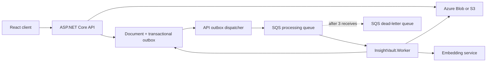

# Durable SQS Document Processing Design

## Purpose

Move InsightVault document processing from a user-triggered API request to a durable, asynchronous workflow. The project must demonstrate AWS SQS and a separate .NET worker while retaining a fully local, zero-AWS-cost development and test path.

## Goals

- A successful document upload creates a durable processing request without waiting for PDF extraction or embeddings.
- A separate worker processes queued documents.
- Duplicate SQS delivery is safe.
- Failed processing is visible as `Failed`, retries through SQS, and can be retried by the document owner from the UI.
- The AWS design contains a processing queue and dead-letter queue, but this step performs no AWS deployment.
- Azure Blob remains the default document-storage provider; the S3 adapter from Step 4 remains selectable.

## Non-goals

- Deploying SQS, the worker, or IAM workload roles to AWS.
- Replacing Azure OpenAI or adding a local embedding model.
- Automatically replaying messages from the dead-letter queue.
- Building a worker dashboard or queue administration interface.

## Architecture

The API writes the `Document` and a processing-outbox entry in the same database save. An API-hosted dispatcher publishes undispatched outbox entries to the queue. It is safe for the dispatcher to retry publishing because the worker is idempotent. This avoids the failure gap where a document is saved but an SQS publish fails.

The queue message contains a version, the `DocumentId`, and the document owner identifier. It never contains PDF content, blob URLs, access keys, or OpenAI credentials.

`InsightVault.Worker` is a .NET Worker Service. It long-polls the queue, creates a DI scope for every message, and invokes the existing document-processing application service. The worker is the only component that consumes processing jobs.

## Application and Domain Behaviour

### Upload

1. Validate and store the PDF through the existing `IBlobStorageService`.
2. Create the document with `Uploaded` status.
3. Create a pending outbox entry for that document in the same database save.
4. Return `201 Created` without extracting text or generating embeddings.

The dispatcher attempts to publish the pending message promptly and periodically retries undispatched entries. A temporary queue outage therefore leaves a durable, recoverable request rather than losing the upload.

### Worker processing and idempotency

1. Parse and validate the message version and identifiers.
2. Load the document for its owner.
3. If it no longer exists, acknowledge the message without processing.
4. If its status is `Processed`, acknowledge it without processing again.
5. Otherwise run the existing extraction, chunking, embedding, and persistence workflow.
6. Acknowledge the message only after successful processing or a safe idempotent outcome.

Amazon SQS is at-least-once delivery. The `Processed` short-circuit makes a repeated delivery after a successful attempt safe. The repository continues to replace document chunks as one processing result rather than appending duplicate chunks.

### Failure and retry

When processing throws, the application service marks the document `Failed` and persists that state. The worker does not delete the message, allowing SQS to redeliver it after the visibility timeout. The processing queue moves a message to the DLQ after three receives.

`POST /api/documents/{id}/retry-processing` is permitted only to the document owner and only when its status is `Failed`. It resets the document to `Uploaded`, creates another outbox entry, and returns the updated document. The React client replaces the existing **Process** button with **Retry processing**, shown only for failed documents.

## Project Boundaries

### Application

Application owns the queue abstractions, the versioned processing-job record, retry use case, and outbox repository contract. It must not reference the AWS SDK, LocalStack, or Infrastructure.

### Infrastructure

Infrastructure implements queue transport with the AWS SDK for SQS and persists outbox entries with EF Core. It supplies configuration for real SQS and an explicit LocalStack endpoint. LocalStack credentials are dummy, local-only values. When no local endpoint is configured, the AWS SDK uses the deployed workload role rather than static keys.

### API

The API remains thin: it binds upload/retry requests and delegates to Application services. It hosts the outbox dispatcher because it owns upload creation, but does not process PDFs itself.

### Worker

The Worker project references Application and Infrastructure, registers the same processing dependencies through DI, and contains only long-polling and message acknowledgement orchestration. It has no HTTP controllers.

## Local Development and Tests

Docker Compose receives an opt-in `queue` profile running LocalStack with SQS enabled. The test suite uses a temporary LocalStack container or a dedicated queue emulator fixture; it never uses the developer's AWS SSO profile or AWS account.

Tests cover:

- upload creates one pending outbox request
- dispatcher publishes a correctly versioned message
- worker success acknowledges the message and results in `Processed`
- duplicate message for a processed document does not call extraction or embeddings again
- processing failure leaves the message retryable and records `Failed`
- retry is rejected for non-failed documents and accepted for a failed document owner
- queue and DLQ redrive configuration is correct in the local emulator

## Terraform Design

The AWS module declares:

- a standard document-processing queue with long polling and a processing-appropriate visibility timeout
- a dead-letter queue
- redrive after three receives
- SQS-managed server-side encryption, avoiding customer-managed KMS keys
- resource tags consistent with the existing module

The queue resources are behind an explicit `enable_document_processing_queues` variable that defaults to `false`. No command in this step runs `terraform plan` or `terraform apply`. A future deployment milestone will add least-privilege workload roles separately.

## Configuration and Security

- `Queue:Provider` defaults to `Disabled` so the current application can run without SQS configuration until the queue path is deliberately enabled.
- `Queue:Provider=LocalStack` requires the local endpoint and dummy values only.
- `Queue:Provider=Sqs` accepts queue URLs and region but no access-key settings; AWS credential resolution comes from the workload role in deployment.
- Queue message payloads exclude document contents and secrets.
- The main queue and DLQ remain private; no public policy is declared.

## Acceptance Criteria

- Upload returns without performing synchronous processing and produces a durable queued request.
- A separate worker can process the request locally through the queue emulator.
- Failed documents expose a retry action only in `Failed` state.
- Duplicate deliveries cannot duplicate processed chunks or embeddings.
- Terraform validates locally without creating resources and prevents queue resources by default.
- The API, worker, and tests use no static AWS credentials.
