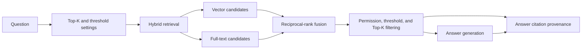

# Retrieval, Citations, and Quality Design

## Purpose

Improve InsightVault's RAG retrieval quality and auditability without adding a cloud deployment or a user-facing answer history screen. Answers will retain the exact document chunks that supported them, including document version and page/section metadata.

## Goals

- Make retrieval behaviour configurable through a default Top-K and minimum similarity threshold.
- Preserve document version, source page, and section metadata on processed chunks.
- Use hybrid full-text and vector retrieval while preserving document permissions.
- Persist answer-to-chunk provenance for audit and later history features.
- Add a small version-controlled evaluation dataset and deterministic retrieval-quality tests.
- Keep PostgreSQL plus pgvector as the preferred path and retain the current SQL Server local fallback.

## Non-goals

- A user-facing answer-history screen.
- Replacing Azure OpenAI or adding a new paid service.
- Deploying PostgreSQL, SQS, or any AWS resource.
- Reprocessing existing stored documents automatically.

## Architecture

Application owns query validation, candidate fusion, final ranking, provenance contracts, and answer orchestration. Infrastructure owns PostgreSQL full-text/pgvector queries, SQL Server fallback queries, and EF Core persistence. The API remains a thin request-binding layer.

## Metadata and persistence

`Document` receives a `Version` beginning at `1`. Future replacement behaviour can increment the version without invalidating a past answer's source record.

`DocumentChunk` receives a source page number and optional section title. PDF extraction returns page-aware segments. Chunking retains the page/section that produced each chunk; a chunk spanning pages records its first source page and a page range when available.

New persistence entities:

- `ChatAnswer`: owner ID, question, generated answer, creation time, Top-K, threshold, and retrieval strategy version.
- `ChatAnswerCitation`: answer ID, document ID, document version, chunk ID, page/section fields, final score, and final rank.

The response still returns citations to the client. Persisted provenance is not exposed through a new history UI in this step.

## Retrieval behaviour

`RetrievalOptions` supplies a validated default Top-K and minimum similarity threshold. The chat request may use the defaults; it does not expose unbounded ranking controls to the client.

For an authorised user:

1. Obtain an embedding for the question.
2. Retrieve a bounded vector candidate set and a bounded full-text candidate set, both permission-filtered and restricted to processed documents.
3. Combine candidates by chunk ID with reciprocal-rank fusion.
4. Use the vector similarity score for threshold eligibility when available; full-text-only candidates need a configurable conservative score.
5. Discard candidates under the threshold, order by fused score with stable document/chunk tie-breaks, and retain Top-K.
6. Send those final chunks to the language model.
7. On successful generation, save `ChatAnswer` and all final citations together.

If no candidate survives, return the existing no-relevant-content message and save no provenance record. If generation or persistence fails, return an error and never leave a partial answer/citation graph.

## Provider design

PostgreSQL uses pgvector cosine distance and PostgreSQL full-text search. The existing SQL Server/local implementation supplies equivalent functional vector and text candidate queries for development. Provider-specific query syntax remains in Infrastructure.

No new static cloud credentials are introduced. The existing Azure Blob/S3 selection remains unchanged.

## Quality evaluation

Store a small JSON dataset in the test project with representative question, expected document/chunk identifiers, and relevance labels. Tests use deterministic repository and embedding doubles rather than OpenAI or AWS.

The suite proves:

- Top-K and threshold filtering.
- Hybrid fusion improves or retains expected ranking.
- Owner/viewer permission filtering.
- Page/section/version metadata reaches returned and persisted citations.
- Answer provenance is saved only after successful generation.
- Evaluation recall@K and precision@K meet documented minimum expectations.

## Acceptance criteria

- Configurable Top-K and similarity threshold determine final retrieval results.
- Every new processed chunk has version/page/section metadata where the extractor supplies it.
- A successful chat answer persists auditable chunk provenance.
- Hybrid retrieval returns permission-safe fused candidates across both providers.
- Evaluation tests run locally with no cloud services and no static credentials.
- No answer-history screen, Terraform deployment, or cloud resource is added.
